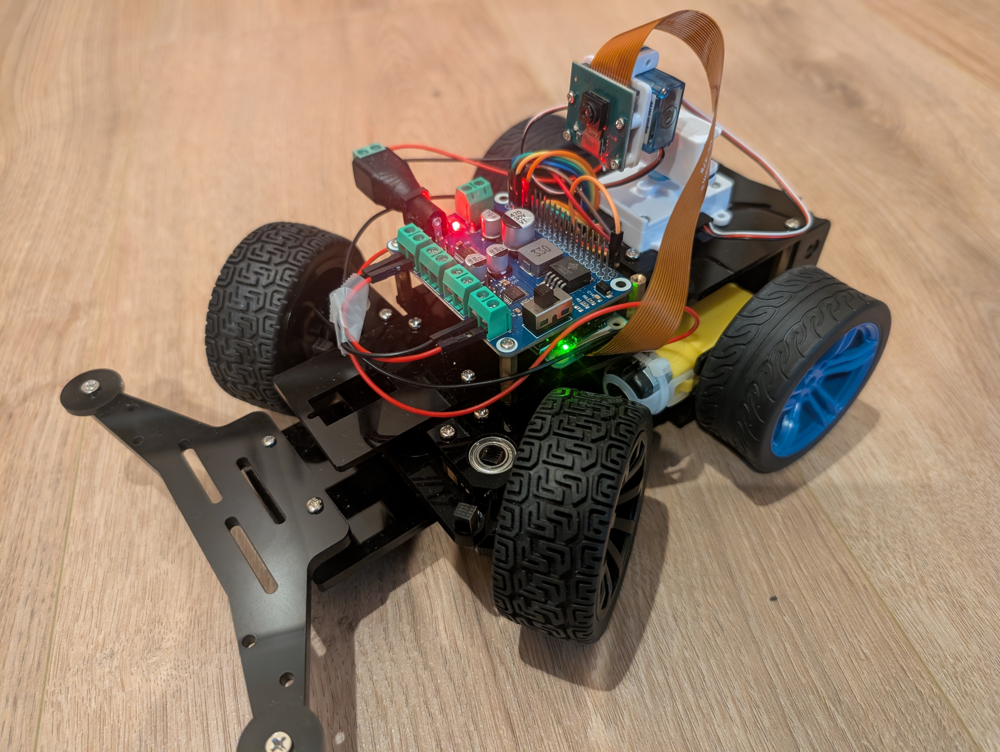
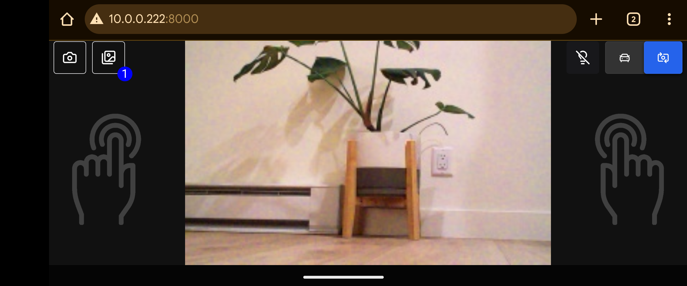
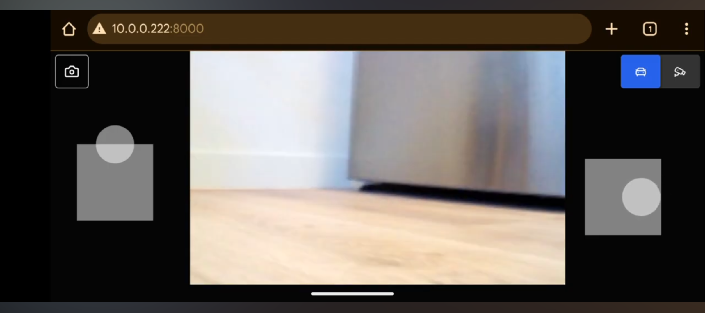

# Raspberry Pi Camera Car

This is a Raspberry Pi car with a mounted camera controlled by a phone using a live video feed and [virtual joysticks](https://github.com/yoannmoinet/nipplejs) on a web page. It's built with Python, Flask, Socket.IO, and React.
  

  <a href="https://www.youtube.com/watch?v=jtcBjbbCzTw" target="_blank">
    
      
    Watch a demo video
  </a>
    

  
    
  Hold the phone sideways and place both thumbs on the screen to activate the virtual joysticks.
    

  
    
  The left joystick makes the car go forward or backward, and the right joystick makes the car turn left or right. The top right buttons toggle between moving the car and moving the camera. The top left button takes an HD photo.
    

## Features

- Low latency in the video streaming and the controls
- Intuitive controls UI with virtual joysticks that allow variability in speed and turning radius
- Toggle the UI between driving mode and camera platform adjustment mode
- The virtual joysticks that control the car movement also control the tilt and pan of the camera
- Take HD photos and save them to an album that can be viewed / inspected with zooming and panning in real time
- Portable; uses two rechargable batteries that power the entire thing including the Raspberry Pi

## How it works

The Raspberry Pi runs a Flask server with socket.io integration, accepting websocket requests to control the movement of the car. The GPIO is integrated through the Python interface to control the steering servo, rear wheel motors, and the camera platform servo positions. The live feed of the camera is served to the frontend through the websocket as a series of low resolution JPG images at 20 frames per second.

The frontend is a React application with two virtual joysticks. The left joystick operates on the vertical plane and controls the forward and backward motion of the car and the tilt of the camera, with speed variability dependant on the force applied to the joystick. The right joystick operates on the horizontal plane and controls the steering of the car and the pan of the camera, with radius / speed variability dependant on the force applied to the joystick. The direction and force of the joysticks are sent to the server every 200 milliseconds to continously sync the car's speed and servo positions.

The photo button, on the top left, takes an HD photo, which gets saved on the Raspberry Pi in a dedicated folder / album. The photos in this album can be viewed, zoomed, and panned through the UI. The camera always initializes two streams - one low resolution stream that handles the continuous video feed, and another high resolution stream to handle the snapshots that can be taken and saved in this album.

## Parts List

- [Raspberry Pi Zero 2WH (3, 4, 5 would also probably work)](https://www.amazon.com/dp/B0DRRDJKDV)
- [LK Cokoino 4WD robot hat shield](https://www.amazon.com/dp/B0D4VYW1PX)
- [LK Cokoino rear-wheel drive robot car chassis with servo](https://www.amazon.com/dp/B0FC2X2LVZ)
- [Arducam camera module](https://www.amazon.com/dp/B01LY05LOE)
- [Arducam camera pan tilt platform](https://www.amazon.com/dp/B08PK9N9T4)
- [18650 2-battery pack with charger](https://www.amazon.com/dp/B0FQ9QQ64K)
- [Dupont jumper wires](https://www.amazon.com/dp/B0BRTHR2RL)
- [Power jack adapter barrel connector](https://www.amazon.com/dp/B0CR8TZ41W)
- [64 GB Micro SD card (could be any size larger than 8GB)](https://www.amazon.com/dp/B0DRRDJKDV)
- [USB C Micro SD card reader](https://www.amazon.com/dp/B0F1G1TNDS)

## How to install

### Hardware

1. Follow the instructions for the robot car chassis assembly
2. Attach the camera to the Raspberry Pi with the ribbon cable
3. Follow the instructions for the camera pan tilt platform assembly, and mount it on the back of the car

### Software

1. Clone this repository on the Raspberry Pi

    `git clone https://github.com/diracleo/pi-camera-car.git`

2. Go into the repository directory

    `cd pi-camera-car`

3. Install

    `make install`

8. Run

    `make run`

9. On your phone, on the same WiFi network as the Raspberry Pi, open the web page

    `http://<IP ADDRESS OF PI>:8000`
